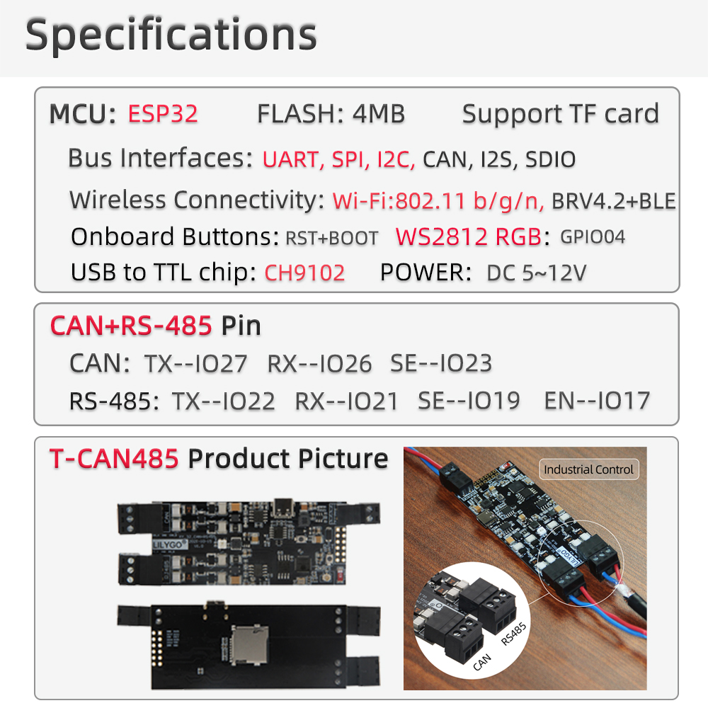
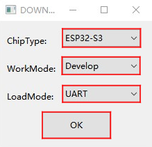
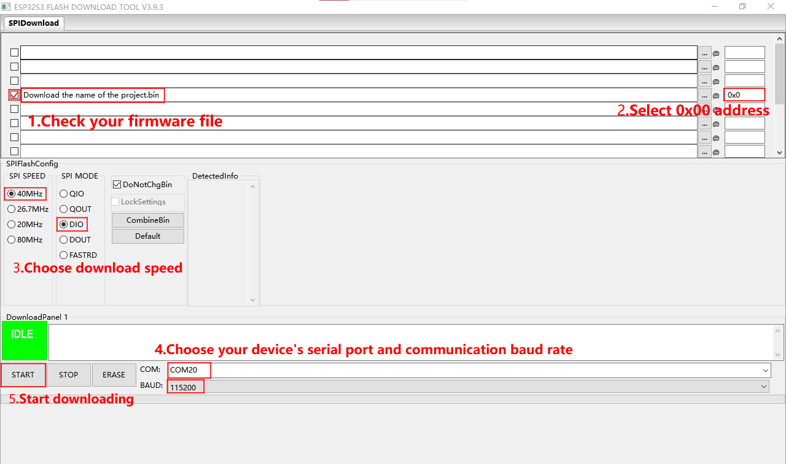

<!--
 * @Description: None
 * @version: V1.0.0
 * @Author: LILYGO_L
 * @Date: 2023-09-11 16:13:14
 * @LastEditors: LILYGO_L
 * @LastEditTime: 2024-06-24 11:24:56
 * @License: GPL 3.0
-->
<h1 align = "center">T-CAN485</h1>

## **English | [中文](./README_CN.md)**

## Version iteration:
| Version                              | Update date                       |
| :-------------------------------: | :-------------------------------: |
| T-CAN485                      | -                         |

## PurchaseLink

| Product                     | SOC           |  FLASH  |  PSRAM   | Link                   |
| :------------------------: | :-----------: |:-------: | :---------: | :------------------: |
| T-CAN485   | ESP32 |   4M   | - |   [AliExpress](https://pt.aliexpress.com/item/1005003624034092.html)  |

## Directory
- [Describe](#describe)
- [Preview](#preview)
- [Module](#module)
- [QuickStart](#quickstart)
- [PinOverview](#pinoverview)
- [RelatedTests](#RelatedTests)
- [FAQ](#faq)
- [Project](#project)
- [Information](#information)
- [DependentLibraries](#dependentlibraries)

## Describe

The T-CAN485 is a core board developed based on the ESP32 chip, featuring 1 CAN bus and 1 RS485 device. It supports high voltage input (5V-12V) and is equipped with a programmable WS2812 RGB LED bead. Additionally, it supports TF card functionality.

## Preview

### PCB board

    

### Details

    

## Module

### 1.MCU

* Chip: ESP32
* FLASH: 4M
* For more details, please visit[Espressif ESP32 Datashee](https://www.espressif.com.cn/sites/default/files/documentation/esp32_datasheet_en.pdf)

### 2. RS485

* Chip: MAX13487EESA+
* Bus communication protocol: UART

### 3. CAN

* Chip: SN65HVD231
* Bus communication protocol: TWAI

### 4. Booster chip

* Chip: ME2107A50M5G

## QuickStart

### Examples Support

| Example | Support IDE And Version| Description | Picture |
| ------  | ------  | ------ | ------ | 
| [CAN](./examples/CAN) | `[Arduino IDE][arduino_esp32_v3.0.1]` |  |  |
| [Original Test](./examples/Original_Test) |`[Arduino IDE][arduino_esp32_v3.0.1]` | Product factory original testing |  |
| [RS485_WS2812B](./examples/RS485_WS2812B) |`[Arduino IDE][arduino_esp32_v3.0.1]` |  |  |
| [SD](./examples/SD) |`[Arduino IDE][arduino_esp32_v3.0.1]` |  |  |
| [WIFI_HTTP_Download_File](./examples/WIFI_HTTP_Download_File) |`[Arduino IDE][arduino_esp32_v3.0.1]` |  |  |
| [WS2812B_Blink](./examples/WS2812B_Blink) |`[Arduino IDE][arduino_esp32_v3.0.1]` |  |  |

| Firmware | Description | Picture |
| ------  | ------  | ------ |
| [Original Test V1.0.0](./firmware/[T-CAN485_V1.0][Original_Test]_firmware_V1.0.0) | Original |  |

### Arduino
1. Install[Arduino](https://www.arduino.cc/en/software),Choose installation based on your system type.

2. Open the "example" directory within the project folder, select the example project folder, and open the file ending with ".ino" to open the Arduino IDE project workspace.

3. Open the "Tools" menu at the top right -> Select "Board" -> "Board Manager." Find or search for "esp32" and download the board files from the author named "Espressif Systems." Then, go back to the "Board" menu and select the development board type under "ESP32 Arduino." The selected development board type should match the one specified in the "platformio.ini" file under the [env] section with the header "board = xxx." If there is no corresponding development board, you may need to manually add the development board from the "board" directory within your project folder.

4. Open menu bar "[File](image/6.png)" -> "[Preferences](image/6.png)" ,Find "[Sketchbook location](image/7.png)"  here,copy and paste all library files and folders from the "libraries" folder in the project directory into the "libraries" folder in this directory.

5. Select the correct settings in the Tools menu, as shown in the table below.

#### ESP32
| Setting                               | Value                                 |
| :-------------------------------: | :-------------------------------: |
| Board                                 | ESP32 Dev Module           |
| Upload Speed                     | 921600                               |
| CPU Frequency                   | 240MHz (WiFi)                    |
| Flash Mode                         | QIO                        |
| Flash Size                           | 4MB (32Mb)                    |
| Core Debug Level                | None                                 |
| PSRAM                                | Disable                         |
| Arduino Runs On                  | Core 1                               |   

6. Select the correct port.

7. Click "<kbd>[√](image/8.png)</kbd>" in the upper right corner to compile,If the compilation is correct, connect the microcontroller to the computer,Click "<kbd>[→](image/9.png)</kbd>" in the upper right corner to download.

### firmware download
1. Open the project file "tools" and locate the ESP32 burning tool. Open it.

2. Select the correct burning chip and burning method, then click "OK." As shown in the picture, follow steps 1->2->3->4->5 to burn the program. If the burning is not successful, press and hold the "BOOT-0" button and then download and burn again.

3. Burn the file in the root directory of the project file "[firmware](./firmware/)" file,There is a description of the firmware file version inside, just choose the appropriate version to download.

    
    

## PinOverview

| RS485 PIN  | ESP32 PIN|
| :------------------: | :------------------:|
| TX         | IO22       |
| RX         | IO21       |
| CALLBACK         | IO17       |
| EN         | IO9       |

| WS2812 PIN  | ESP32 PIN|
| :------------------: | :------------------:|
| DATA         | IO4       |

| ME2107 PIN  | ESP32 PIN|
| :------------------: | :------------------:|
| EN         | IO16       |

| SD PIN  | ESP32 PIN|
| :------------------: | :------------------:|
| MISO         | IO2       |
| MOSI         | IO15       |
| SCLK         | IO14       |
| CS         | IO13       |

## RelatedTests

## FAQ

* Q. After reading the above tutorials, I still don't know how to build a programming environment. What should I do?
* A. If you still don't understand how to build an environment after reading the above tutorials, you can refer to the [LilyGo-Document](https://github.com/Xinyuan-LilyGO/LilyGo-Document) document instructions to build it.

 

* Q. Why does Arduino IDE prompt me to update library files when I open it? Should I update them or not?
* A. Choose not to update library files. Different versions of library files may not be mutually compatible, so it is not recommended to update library files.

 

* Q. Why is my board continuously failing to download the program?
* A. Please hold down the "BOOT-0" button and try downloading the program again.

## Project
* [T-CAN485](./project/T-CAN485.pdf)

## Information
* [MAX13487EESA+](./information/MAX13487EESA+.pdf)
* [SN65HVD231](./information/SN65HVD231.pdf)

## DependentLibraries
* [FastLED-3.7.0](https://github.com/FastLED/FastLED)
