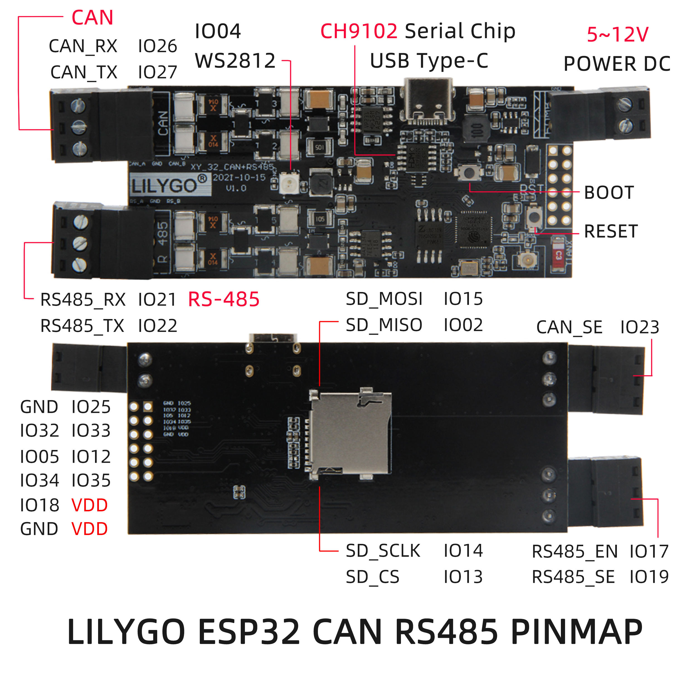
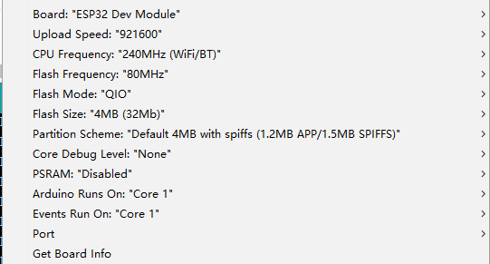

<h1 align = "center">🌟LilyGo T-CAN485🌟</h1>

# Introduce



## Onboard functions
- 1 x RS485 receiver.
- 1 x CAN receiver.
- 1 x TF card connector.
- 1 x WS2812 RGB LED light.
- 8 x Reserved programmable GPIO.

<h3 align = "left">Product 📷:</h3>

|  Product |  Product Link |
| :--------: | :---------: |
| T-CAN485 |  [AliExpress](https://pt.aliexpress.com/item/1005003624034092.html)   |


# Quick Start

## Arduino 
>- Click "File" in the upper left corner -> Preferences -> Additional Development >Board Manager URL -> Enter the URL in the input box
> `https://raw.githubusercontent.com/espressif/arduino-esp32/gh-pages/package_esp32_index.json`

>-  Click OK and the software will be installed by itself. After installation, restart the Arduino IDE software.

>- Arduino Setting 


## PlatfromIO
> - PlatformIO plug-in installation: Click on the extension on the left column -> search platformIO -> install the first plug-in
> - Click Platforms -> Embedded -> search Espressif 32 in the input box -> select the corresponding firmware installation

## ESPHome

Use a package from the [esphome](esphome) directory.

## Udev Setup (Linux)

If your board isn't present on the device tree, create a file with this content:

```bash

$ sudo cat /etc/udev/rules.d/70-lilygo.rules

SUBSYSTEM=="tty", GROUP="plugdev". MODE="0660"
SUBSYSTEMS=="usb", ATTRS{idProduct}=="55d4", ATTRS{idVendor}=="1a86", SYMLINK+="lilygo"
```

Then reload the rules as follow:

```bash
sudo udevadm control --reload-rules && sudo service udev restart && sudo udevadm trigger
```

Un-plug your Lilygo then plug it back, the device should be accessible on `/dev/lilygo`


# Q&A
1. CAN bus protocol does not work properly.

- A:Depending on the ESP32 chip, the CAN controller register IER parameter needs to be changed. If it is a V3 version chip, you can use 0xEF, otherwise, use 0xFF.
